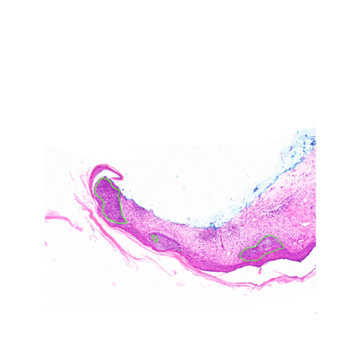
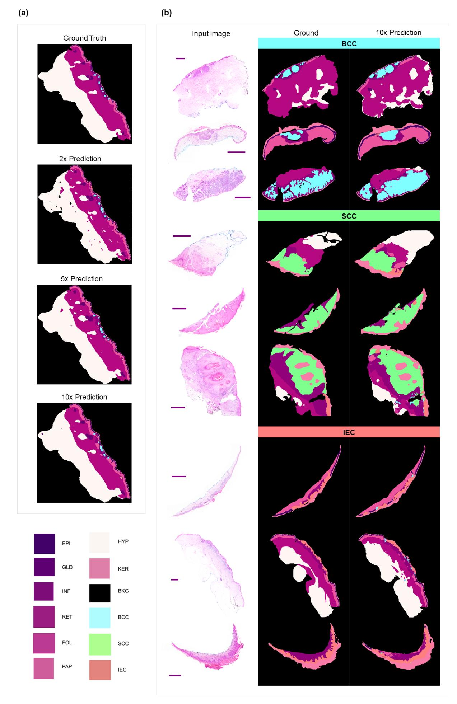

# SkinCancerSegmentation
Repository supporting the paper titled "Interpretable Deep Learning Systems for Multi-Class Segmentation and Classification of Non-Melanoma Skin Cancer" (IN REVIEW)

Authors:
Simon M. Thomas **a, b** ORCID: 0000-0003-4609-2732
James G. Lefevre **a** ORCID: 0000-0002-5945-9575
Glenn Baxter **b**
Nicholas A. Hamilton **a** ORCID: 0000-0003-0331-3427

**a** - Institute for Molecular Bioscience, University of Queensland, 306 Carmody Road, St
Lucia, Australia
**b** - MyLab Pty. Ltd., 11 Hayling Street, Salisbury, Australia

# Experimental Pipeline

The code presented here is intended for the experimental pipeline to be transparent. The data is a private collection and so is unpublished. The models
can be found in `seg_models.py`, and are subquently used in the appropriate enumerated script e.g. `06_model_evaluation.py`. Weights for the 2x, 5x and 10x
fine-tuned models are available in the `./weights/` directory, as are the CNN classifier weights (`10_classification.ipynb`). 

